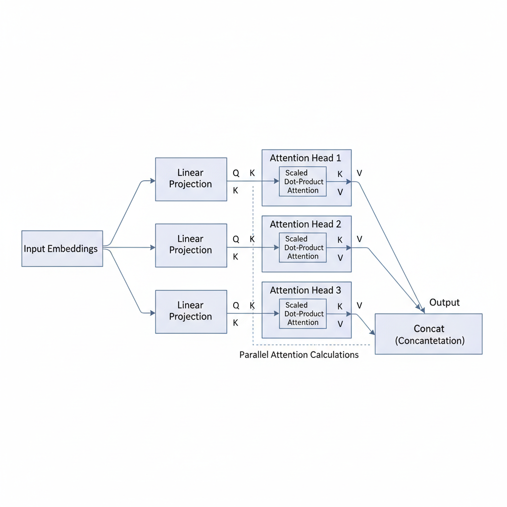

# Understanding Self-Attention in Transformer Architecture

## Introduction to Self-Attention in Transformers

Self-attention is a fundamental mechanism used within transformer architectures to model relationships between elements of a single input sequence. At its core, self-attention allows each position in the sequence to attend to—and thus incorporate information from—every other position. This enables the model to capture contextual dependencies regardless of their distance in the input.

Unlike traditional attention mechanisms that often focus on relating inputs to external memory or another sequence (e.g., encoder-decoder attention), self-attention operates solely within the sequence itself. This contrasts with sequence modeling methods like recurrent neural networks (RNNs), which process tokens sequentially and maintain a hidden state that can lose information over long sequences.

One of the key advantages of self-attention is its inherent parallelizability. Since each token’s attention weights are computed simultaneously across the entire sequence, transformers can leverage hardware acceleration effectively, leading to significantly faster training times compared to RNNs. This parallelism is crucial for scaling models to large datasets and long sequences.

Moreover, self-attention enables transformers to handle long-range dependencies more efficiently. Unlike RNNs, which may struggle with vanishing gradients and limited memory over long sequences, self-attention computes direct pairwise interactions between all tokens. This capability improves the model’s understanding of global context, which is essential for tasks like language modeling, translation, and more.

This section sets the foundation for more technical explorations to come, including the detailed mechanics of query-key-value transformations, multi-head attention, and implementation nuances. Understanding self-attention’s role is critical for appreciating how transformers revolutionize sequence modeling in contemporary deep learning.

## The Mechanics of Scaled Dot-Product Self-Attention

In transformer architectures, self-attention enables each token in the input sequence to dynamically attend to other tokens to better capture contextual relationships. Let’s break down the core computations involved in scaled dot-product self-attention.

### Query, Key, and Value Vectors

The process begins by projecting the input embeddings into three distinct vectors: **queries (Q)**, **keys (K)**, and **values (V)**. These vectors have dimensions tailored for the attention mechanism:

- The input is a matrix \(X \in \mathbb{R}^{n \times d_{model}}\), where \(n\) is the sequence length and \(d_{model}\) is the embedding dimension.
- We use learned weight matrices \(W_Q, W_K, W_V \in \mathbb{R}^{d_{model} \times d_k}\) to linearly transform \(X\) into queries, keys, and values respectively:

\[
Q = X W_Q, \quad K = X W_K, \quad V = X W_V
\]

Here, \(d_k\) is typically smaller or equal to \(d_{model}\) and represents the dimensionality of queries and keys.

### Calculating Attention Scores

Next, to compute how much focus each token should give to every other token, we calculate attention scores by taking the dot product of queries with keys:

\[
\text{scores} = Q K^\top
\]

This produces an \(n \times n\) matrix indicating raw attention compatibility between pairs of tokens. Because large dot-product values can lead to gradients that vanish or explode, the scores are scaled by dividing by \(\sqrt{d_k}\):

\[
\text{scaled scores} = \frac{Q K^\top}{\sqrt{d_k}}
\]

The scaling stabilizes training by keeping values within a range amenable to softmax.

### Applying Softmax to Obtain Attention Weights

We then apply the softmax function along each query vector’s scores to convert them into probabilistic attention weights:

\[
\text{attention weights} = \text{softmax}\left(\frac{Q K^\top}{\sqrt{d_k}}\right)
\]

Each row sums to 1, representing the distribution of attention each token pays to all tokens in the sequence.

### Computing Context Vectors

These attention weights are used to compute a weighted sum of the value vectors, producing the output context vectors:

\[
\text{context} = \text{attention weights} \times V
\]

The result is a matrix \(C \in \mathbb{R}^{n \times d_k}\) where each row aggregates information from relevant tokens, weighted by how strongly the model attends to them.

### Code Sketch of Scaled Dot-Product Attention

Below is a minimal PyTorch-like pseudocode illustrating these key steps with matrix operations:

```python
import torch
import torch.nn.functional as F

def scaled_dot_product_attention(X, W_Q, W_K, W_V):
    # X: [n, d_model]
    # W_Q, W_K, W_V: [d_model, d_k]
    Q = X @ W_Q          # [n, d_k]
    K = X @ W_K          # [n, d_k]
    V = X @ W_V          # [n, d_k]

    d_k = Q.size(-1)
    scores = Q @ K.transpose(-2, -1) / d_k**0.5  # [n, n]
    attention_weights = F.softmax(scores, dim=-1)  # [n, n]

    context = attention_weights @ V  # [n, d_k]
    return context, attention_weights
```

### Computational Complexity and Cost

The computation has complexity roughly \(O(n^2 d_k)\) due to the \(n \times n\) attention score matrix. This quadratic scaling in sequence length \(n\) becomes the bottleneck for very long inputs:

- Memory usage grows as \(O(n^2)\) since attention weights must be stored.
- Computational cost increases quadratically, impacting training and inference speed.

To manage this, practitioners often use:

- Sequence truncation or chunking.
- Sparse or approximate attention mechanisms.
- Efficient hardware acceleration (e.g., GPUs/TPUs).

Understanding these mechanics helps developers optimize transformer implementations and troubleshoot performance bottlenecks effectively.

## Multi-Head Attention: Enhancing Model Expressivity

Multi-head attention is a fundamental extension of the basic self-attention mechanism, designed to improve the model's ability to capture diverse patterns and relationships within the input data. Instead of computing attention once, multi-head attention splits the queries, keys, and values into multiple smaller sets, called heads, and performs attention independently on each. This parallelism allows the model to focus on different parts or aspects of the input simultaneously.

### Splitting Into Multiple Heads

Concretely, given the input embeddings, the transformer applies learned linear projections to produce multiple sets of queries (Q), keys (K), and values (V). Suppose we have \( h \) heads. The original \( d_{model} \)-dimensional Q, K, and V vectors are split into \( h \) smaller vectors, each of dimension \( d_k = d_{model} / h \). Each head then computes scaled dot-product attention independently:

\[
\text{Attention}(Q_i, K_i, V_i) = \text{softmax}\left(\frac{Q_i K_i^T}{\sqrt{d_k}}\right) V_i
\]

where \( i \in [1, h] \). This allows each head to attend to different representation subspaces, capturing varying contextual signals.

### Benefits of Multiple Representation Subspaces

By allowing each head to focus on information from different learned projections, multi-head attention enhances expressivity. Some heads might capture syntactic relations like word order, while others capture semantic associations or long-range dependencies. This diversified attention improves the network's ability to integrate multiple perspectives simultaneously, especially beneficial for complex language understanding or sequence modeling tasks.

### Concatenation and Linear Transformation of Heads

After each head produces its output tensor of shape \((seq\_len, d_k)\), the results are concatenated along the feature dimension, reconstructing a \((seq\_len, d_{model})\) tensor:

\[
\text{MultiHead}(Q, K, V) = \text{Concat}(\text{head}_1, \dots, \text{head}_h) W^O
\]

Here, \( W^O \) is a learned linear transformation matrix of shape \((d_{model}, d_{model})\) that projects the concatenated outputs to the final feature space for subsequent layers.

### Minimal Pseudocode for Multi-Head Attention

```python
def multi_head_attention(Q, K, V, num_heads):
    d_model = Q.shape[-1]
    d_k = d_model // num_heads

    # Linear projections for all heads
    Q_heads = linear_projection(Q, num_heads, d_k)  # shape: (num_heads, seq_len, d_k)
    K_heads = linear_projection(K, num_heads, d_k)
    V_heads = linear_projection(V, num_heads, d_k)

    heads_output = []
    for i in range(num_heads):
        # Scaled dot-product attention per head
        scores = (Q_heads[i] @ K_heads[i].T) / sqrt(d_k)
        weights = softmax(scores, axis=-1)
        head_i = weights @ V_heads[i]
        heads_output.append(head_i)

    # Concatenate heads and apply output linear projection
    concatenated = concatenate(heads_output, axis=-1)  # shape: (seq_len, d_model)
    output = linear_transform(concatenated)
    return output
```

### Trade-offs Between Number of Heads and Efficiency

Increasing the number of heads can improve model expressivity by allowing finer-grained attention, but it comes with computational trade-offs:

- **Memory and compute cost**: More heads multiply the number of linear projections and attention computations, increasing both memory usage and runtime.
- **Dimensionality per head**: As heads increase, \( d_k \) shrinks because \( d_k = d_{model} / num\_heads \). If \( d_k \) becomes too small, each head may lose the ability to encode meaningful information, reducing effectiveness.
- **Diminishing returns**: Beyond a certain number, adding heads yields marginal gains and may lead to overfitting or noisier gradients.

In practice, common architectures like the original Transformer use 8 or 16 heads as a balance. Careful tuning is essential to optimize for the task and resource constraints. Monitoring attention patterns and validation performance can guide adjustments to the number of heads.

---

Understanding multi-head attention's role in distributing the model's focus enables developers to fine-tune transformer architectures for improved accuracy and efficiency across diverse applications.

## Position Encodings: Injecting Sequence Order into Self-Attention

Self-attention mechanisms in transformer architectures operate by computing pairwise relationships between all tokens in an input sequence simultaneously. However, unlike recurrent or convolutional networks, the self-attention operation itself is **permutation-invariant**, meaning it treats input tokens as a set rather than an ordered list. This leads to a critical limitation: the model cannot inherently distinguish the position or order of tokens without explicit positional information. Consequently, position encodings are introduced to provide sequence order cues essential for understanding language, code, or any sequential data.

There are two primary strategies for encoding positional information:

- **Sinusoidal Position Encodings**: Introduced in the original Transformer paper, these encodings rely on fixed sinusoidal functions of different frequencies. Each position is represented as a vector whose dimensions are computed using sine and cosine functions with varying wavelengths. This deterministic nature enables the model to potentially generalize to sequences longer than those seen during training, as position values can extrapolate naturally.

- **Learned Position Embeddings**: These are trainable vectors indexed by token position. The model learns positional representations from data alongside token embeddings, offering flexibility to adapt to dataset-specific ordering patterns. However, learned embeddings may struggle with sequences longer than the training distribution, as positions outside the learned indices lack learned vectors.

Position encodings are combined with token embeddings **by element-wise addition** at the input to the transformer layers. Suppose \(E\) is the token embedding matrix and \(P\) is the position encoding matrix of the same dimensions; the input to the first self-attention layer is:

\[
X = E + P
\]

This additive approach seamlessly integrates positional cues with semantic information before self-attention computations.

### Pros and Cons of Position Encoding Methods

| Method             | Pros                                            | Cons                                              |
|--------------------|-------------------------------------------------|---------------------------------------------------|
| Sinusoidal         | - Fixed, no additional parameters<br>- Enables extrapolation to longer sequences<br>- Smooth representation | - May be less adaptive to specific datasets<br>- Performance sometimes slightly behind learned embeddings |
| Learned Embeddings | - Allows model to learn optimal positional features<br>- Often yields better performance on seen sequence lengths | - Adds parameters<br>- Poor extrapolation to unseen sequence lengths |

### Impact on Generalization and Training Dynamics

The choice of position encoding affects how well a model generalizes beyond training data. Sinusoidal encodings promote better **out-of-distribution length generalization** by providing a continuous, smooth position representation. Learned encodings may lead to better in-distribution accuracy but can cause training instability or degradation when encountering longer or different-structured sequences.

From a training perspective, learned embeddings can increase model capacity and adapt positional knowledge more flexibly, but this comes with potential overfitting risks. Sinusoidal encodings provide a strong inductive bias that stabilizes training but may limit adaptability.

Understanding these trade-offs allows engineers to select or design position encoding schemes suited to their domain and application needs, sometimes leading to hybrid or relative positional representations for enhanced performance.

## Common Challenges and Debugging Self-Attention Implementations

Implementing self-attention in transformer architectures involves several nuanced challenges that can impact model correctness and performance. Awareness of these pitfalls and practical debugging strategies can help ensure robust implementations.

### Common Mistakes

- **Incorrect tensor dimension alignment:** A frequent error is misaligning the query, key, and value tensors, leading to shape mismatch errors during matrix multiplication. Remember that queries and keys must share a compatible dimension for dot-product operations, typically the head dimension.
- **Scaling errors:** The attention scores need to be scaled by the square root of the key dimension (√d_k). Omitting this step or using the wrong scaling factor can cause gradients to vanish or explode, impairing training stability.

### Verifying Attention Score Distributions

- After computing raw attention scores (dot-products), applying the softmax function should yield a probability distribution. Verify that the softmax output:
  - Is non-negative.
  - Rows sum to 1 or close to 1, accounting for floating-point precision.
- Checking these properties confirms softmax correctness and can catch implementation errors early.

### Numerical Stability and Masking

- Softmax operations can suffer from numerical instability due to large exponentials. Implement the standard trick of subtracting the max score from logits before softmax to improve stability.
- Padding tokens should be masked out by assigning large negative values (e.g., -1e9) to their corresponding attention scores before softmax, preventing the model from attending to padding.

### Debugging Tips

- **Visualizing attention maps:** Plotting the attention weights can reveal whether the model attends as expected, highlighting attention on relevant tokens or identifying anomalies such as uniform attention.
- **Checking intermediate tensor shapes:** Logging shapes of queries, keys, values, attention scores, and outputs at various stages helps quickly locate dimension mismatches or broadcasting errors.

### Profiling Performance and Memory Usage

- Self-attention layers can be computationally intensive and memory-heavy, especially with long sequences.
- Use profiling tools (e.g., PyTorch’s `torch.cuda.profiler` or TensorFlow’s profiler) to monitor kernel execution and memory footprint.
- Look for bottlenecks such as excessive intermediate tensor creation or inefficient batch sizes; optimizing these can significantly speed up training and inference.

By carefully aligning dimensions, validating softmax outputs, enforcing numerical stability, masking padding tokens, and leveraging visualization and profiling, developers can reliably diagnose and fix common issues in self-attention implementations, leading to more efficient and stable transformer models.

## Performance and Scaling Considerations in Self-Attention

Self-attention mechanisms in transformers inherently exhibit quadratic complexity relative to the input sequence length. Specifically, the attention calculation requires computing interactions between all pairs of tokens in a sequence, resulting in an O(n) time and memory complexity where n is the sequence length. This quadratic scaling poses significant computational challenges, especially for long sequences, leading to high latency and memory consumption.

To mitigate this, several optimization strategies have been developed. Sparse attention restricts the attention computation to a subset of token pairs, often using fixed patterns or learned masks to reduce the number of interactions. For example, local window attention or dilated attention limits the receptive field, lowering complexity to near-linear for certain configurations. Memory-compressed attention reduces dimensionality or aggregates representations before computing attention, effectively decreasing resource requirements. Approximate attention methods use techniques like low-rank factorization or kernel approximations to estimate attention scores efficiently without full pairwise computations.

Batch size, hardware acceleration, and parallelization are critical factors in optimizing self-attention performance. Utilizing GPUs or TPUs with optimized libraries (e.g., CUDA-enabled kernels or XLA compiler optimizations) significantly speeds up matrix operations central to self-attention. Parallelization across sequence length, batch elements, and attention heads helps distribute computation but must be balanced against increased synchronization overhead. Larger batch sizes improve hardware throughput but may increase memory demands and affect convergence behavior.

These optimization choices come with trade-offs. Sparse and approximate methods reduce memory footprint and latency but can degrade model accuracy or convergence stability if not carefully tuned. Conversely, full attention maximizes representational capacity at the cost of higher resource consumption. Selecting the right balance depends on application constraints such as latency tolerance, hardware availability, and desired model performance.

Practical guidelines for scaling self-attention efficiently include:

- Profile and benchmark your model on target hardware to identify bottlenecks.
- Use sparse or memory-compressed attention for sequences exceeding typical length limits (e.g., over 512 tokens).
- Leverage mixed precision training to reduce memory usage without significant accuracy loss.
- Employ efficient batching combined with parallelized attention computations.
- Gradually increase sequence length during training to maintain stability.

By applying these strategies, developers can optimize self-attention transformers to handle longer sequences and larger batch sizes effectively while controlling latency and memory use.


*Illustration of multi-head self-attention showing splitting into multiple heads, parallel computation of attention scores, and concatenation of heads.*