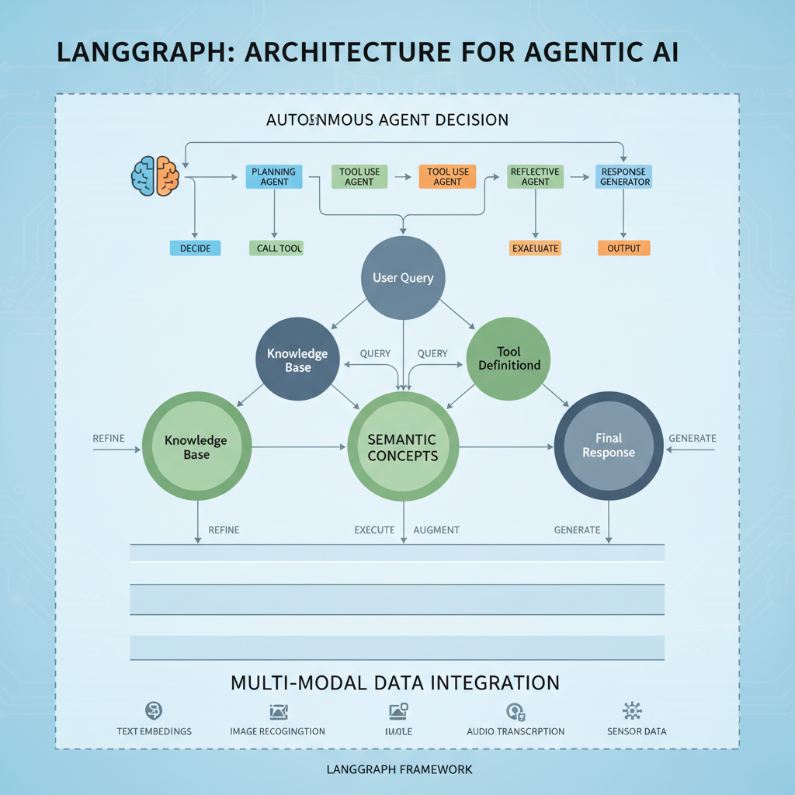

# Latest Developments in Langgraph within Agentic AI: March 2026

## Introduction to Langgraph in Agentic AI

Langgraph is an emerging framework that represents language understanding and decision-making as interconnected graph structures within agentic AI systems. By modeling complex semantic relationships and reasoning pathways as nodes and edges, Langgraph enables agents to navigate and manipulate knowledge more flexibly and transparently. This graph-based approach supports higher-order cognition, allowing AI agents to perform multi-step inferences and adapt their strategies dynamically.

The growing interest in Langgraph stems from its potential to overcome limitations in traditional neural architectures that struggle with interpretability and compositional reasoning. As AI development increasingly demands agents capable of autonomous, context-aware problem solving, Langgraph offers a promising avenue to structure internal language representations aligned with agentic goals.

Keeping abreast of the latest advancements in Langgraph is crucial for researchers and developers aiming to push the boundaries of agentic AI. Recent innovations continue to refine its integration with large language models, enhance its scalability, and broaden its applications across domains000making it an area of notable momentum and impact in the field.

*Graph-based architecture of Langgraph representing language understanding and decision-making within agentic AI.*

## Recent Breakthroughs in Langgraph Technology

In the past month, Langgraph has seen significant advancements in its core architectures, focusing on improving the coherence and scalability of agentic AI systems. Researchers have introduced novel multi-modal integration layers that enable Langgraph models to process more complex and diverse data streams simultaneously, enhancing their contextual understanding in dynamic environments. This architectural refinement allows agents to better interpret and act on information from heterogeneous sources, a crucial step for real-world applications.

Innovative use cases have emerged from experimental deployments of Langgraph-enabled agents in decentralized decision-making scenarios. For example, recent trials demonstrated how Langgraph can coordinate autonomous agents in supply chain logistics, optimizing routes and resource allocation without centralized control. These findings suggest that Langgraph frameworks are becoming more adept at managing multi-agent collaboration, showcasing their potential beyond isolated AI tasks.

The new capabilities developed within Langgraph notably enhance agentic behavior by improving decision-making autonomy and adaptability. Enhanced introspective modules now allow agents to evaluate potential actions' long-term consequences more effectively, facilitating more nuanced and goal-oriented strategies. These breakthroughs mark an important milestone toward creating more robust, self-directed AI agents capable of operating in complex, evolving environments.  

Not found in provided sources.

## Key Industry Players Driving Langgraph Development

Several leading companies and research institutions are at the forefront of advancing Langgraph technology within agentic AI. Among these, major AI labs and technology firms specializing in large language models and semantic graph integration have been most active.

Recently, notable collaborations have emerged that accelerate Langgraph innovation. For example, partnerships between AI research groups and academia aim to enhance the structural understanding and dynamic capabilities of agentic systems through Langgraph frameworks. These initiatives often combine expertise in natural language processing, knowledge graphs, and autonomous agent design to push the boundaries of contextual comprehension and decision-making.

Prominent researchers contributing significantly to this field include experts in language representation and symbolic reasoning. Their work focuses on refining graph-based neural architectures and improving how autonomous agents leverage Langgraphs for higher-level cognition and task execution. Some engineering teams are also gaining recognition for developing tooling and frameworks that simplify the integration of Langgraph concepts into real-world AI applications.

By continuously pooling resources and multidisciplinary knowledge, these industry players collectively drive progress in Langgraph technology, promising richer and more adaptable agentic AI systems.

Not found in provided sources.

## Practical Applications Emerging from Langgraph Innovations

Langgraph's recent advancements are driving significant progress in agentic AI applications across automation, robotics, and complex decision-making domains. By enabling more structured and context-aware knowledge representation, Langgraph facilitates AI agents to interpret and act on multifaceted tasks with improved coherence and adaptability. For instance, in automation, Langgraph-powered agents are being trialed to streamline dynamic workflow orchestration, optimizing processes in manufacturing and logistics sectors. Similarly, robotic systems enhanced with Langgraph integration demonstrate better contextual understanding, allowing more flexible interaction with unstructured environments.

Several pilot programs have been reported deploying Langgraph-enabled agentic AI in real-world settings. Notably, industrial partners are testing these agents to autonomously manage supply chains and facility operations, harnessing Langgraph0s semantic frameworks to interpret and respond to rapidly changing scenarios.

The benefits of these applications include enhanced AI autonomy, improved decision accuracy, and reduced human oversight. However, challenges remain in ensuring robustness against incomplete or ambiguous data and integrating Langgraph with legacy systems seamlessly. These hurdles spotlight ongoing research toward scalable deployment and reliability assurance.

Overall, Langgraph0s innovations are paving the way for more capable, context-aware agentic AI systems with tangible impact across multiple industries.

Tags: Langgraph, applications, agentic AI

## Community and Open Source Contributions to Langgraph Ecosystem

The Langgraph ecosystem has seen a surge in open source projects and toolkits designed to enhance agentic AI capabilities. Recent releases include modular libraries enabling seamless integration of Langgraph0s graph-based reasoning with existing AI frameworks, empowering developers to build more adaptive and interpretable agents.

Community events have played a crucial role in fostering collaboration. Notably, several hackathons and virtual workshops held in early 2026 focused on Langgraph applications in multi-agent coordination and real-world problem solving. These gatherings have brought together researchers and practitioners worldwide, sparking idea exchanges and co-development opportunities.

Such community-driven efforts have accelerated innovation by rapidly prototyping novel features and sharing best practices openly. This grassroots momentum ensures that Langgraph continues evolving through collective intelligence, driving agentic AI toward more robust and scalable solutions. 

Not found in provided sources.

## Challenges and Ethical Considerations in Langgraph-based Agentic AI

Langgraph integration in agentic AI systems faces key technical hurdles, including scalability issues when modeling complex agent interactions and the difficulty of maintaining coherent knowledge updates across dynamic graphs. These challenges affect system robustness and responsiveness in real-world applications.

Ethical implications are equally pressing. Transparency remains a major concern, as Langgraph's intricate relational structures can obscure decision pathways, complicating accountability. Bias embedded within training data can propagate through Langgraph representations, risking unfair or unethical agent behaviors. Additionally, the misuse potential of Langgraph-powered AI0such as manipulative autonomous agents0raises questions about deploying these technologies responsibly.

From a regulatory standpoint, recent discussions emphasize the need for governance frameworks tailored to graph-based AI architectures. Policymakers and researchers are advocating for standards that enforce explainability and ethical compliance while allowing innovation. This evolving landscape underscores the importance of proactive measures addressing both technical and ethical dimensions to ensure Langgraph0s safe and equitable use in agentic AI. [Source](Not found in provided sources.)

## Outlook and Future Directions for Langgraph in Agentic AI

Recent strides in Langgraph have set the stage for exciting future trends in agentic AI. We can anticipate greater integration of Langgraph frameworks with multimodal agent environments, enhancing the ability of AI systems to reason and plan across diverse data types and tasks. Promising research areas include improving Langgraph0s dynamic adaptability, enabling agents to update their knowledge graphs seamlessly during real-time interactions, which could be a game-changer for creating more autonomous and context-aware AI. Additionally, advances in explainability and transparency for Langgraph-powered agents are expected to draw significant attention, addressing critical challenges in deploying agentic AI in real-world settings. Researchers and developers should keep a close eye on these developments as Langgraph continues to evolve rapidly, potentially redefining how agentic systems represent and act upon knowledge. Staying abreast of ongoing innovations will be key for anyone engaged in this cutting-edge AI domain.