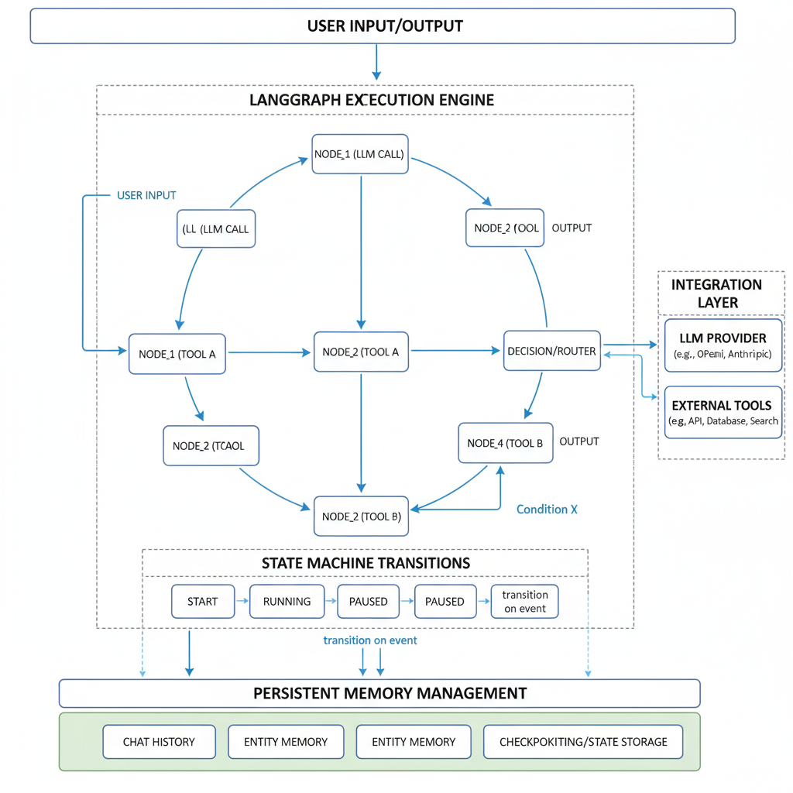

# Mastering Agentic AI with LangGraph: Building Advanced Autonomous Workflows

## Introduction to LangGraph and Agentic AI

Agentic AI represents a transformative shift in the AI landscape, moving beyond passive models to systems capable of autonomous decision-making and goal-directed actions. Unlike traditional AI, which often requires human intervention at every step, agentic AI systems can evaluate situations, plan, and execute complex workflows without constant oversight. This capability is essential today as industries demand scalable, adaptive automation that can handle dynamic environments—from customer service bots that resolve issues independently to robotics that navigate unpredictable physical spaces.

LangGraph emerges as a cutting-edge framework designed to empower developers in building such agentic AI systems. It extends concepts popularized by LangChain but broadens the scope from simple chains of tasks to highly flexible, graph-structured workflows. Where LangChain typically strings together language model calls in a linear fashion, LangGraph leverages graph-based modeling to represent multiple interdependent AI agents and their interactions, supporting stateful and autonomous workflows with greater complexity and robustness ([Source](https://www.digitalocean.com/community/tutorials/getting-started-agentic-ai-langgraph), [Source](https://medium.com/@shiqs90/a-beginners-guide-to-langgraph-in-agentic-ai-33a60807cc3b)).

The core advantage of LangGraph lies in its graph-based architecture. This approach organizes AI workflows as interconnected nodes, where each node represents an autonomous agent or a workflow component. These nodes can communicate, share state, and adapt dynamically based on feedback and external inputs. This structuring allows developers to model real-world processes more naturally and build systems that better reflect the complexity of domain-specific tasks. For example, a customer support AI workflow might include nodes for query understanding, multi-turn dialogue management, retrieval of contextual documents, and escalation to human agents, all orchestrated seamlessly within the graph ([Source](https://www.pluralsight.com/resources/blog/ai-and-data/langchain-langgraph-agentic-ai-guide)).

Practically, LangGraph has found applications across various domains:

- **Customer Support:** Autonomous agents triage and resolve queries by dynamically selecting relevant knowledge sources and determining when to escalate complex issues.
- **Automation:** Businesses deploy LangGraph-powered agents to handle multi-step workflows such as onboarding processes, scheduling, and compliance checks without manual input.
- **Robotics:** In robotic control systems, LangGraph coordinates sensory inputs, decision-making nodes, and actuation commands to enable adaptive, real-time autonomy.

Through its scalable, modular design, LangGraph equips AI developers and ML engineers to build advanced agentic systems that are both maintainable and extensible—paving the way for more intelligent, self-governing AI across industries ([Source](https://www.capsolver.com/blog/AI/top-9-ai-agent-frameworks-in-2026)).

By understanding the principles behind agentic AI and harnessing LangGraph’s unique capabilities, you can design next-generation autonomous workflows that are proactive, resilient, and highly performant. In the following sections, we will dive deeper into LangGraph’s architecture, explore hands-on examples, and discuss best practices for architecting your own agentic AI solutions.

## Core Architecture and Concepts Behind LangGraph

LangGraph embodies a sophisticated graph-based architecture designed to empower agentic AI workflows with modularity, scalability, and robustness. At its core, this architecture represents workflows as directed graphs where each **node corresponds to a cognitive or action step**—such as reasoning, decision-making, tool invocation, or data fetching. These nodes are connected by edges that define the control flow and data dependencies, effectively modeling the agent’s thought process and actions as an explicit, navigable structure. This enables developers to visualize, debug, and optimize complex AI workflows more intuitively than traditional linear pipelines ([Source](https://www.digitalocean.com/community/tutorials/getting-started-agentic-ai-langgraph)).

A key technical innovation in LangGraph is **the integration of state machines to manage complex and cyclical workflows**. Unlike linear execution models, agentic AI frequently requires iterative deliberation, backtracking, and conditional branching. State machines in LangGraph track the current “state” of the workflow, allowing transitions between cognitive phases (e.g., hypothesis generation 1 evaluation 1 external tool call 1 reassessment). This design not only elegantly handles loops and retries but also introduces well-defined checkpoints for error recovery and concurrency control ([Source](https://medium.com/@shiqs90/a-beginners-guide-to-langgraph-in-agentic-ai-33a60807cc3b)).

LangGraph’s architecture seamlessly **integrates Large Language Models (LLMs) with external tools and knowledge bases**, creating a hybrid system capable of both natural language reasoning and grounded data retrieval or execution. Nodes can invoke LLM API calls for tasks like summarization or creative reasoning while simultaneously calling specialized APIs for databases, search engines, or domain-specific tools. This modular interoperation is critical for building autonomous agents that do not solely rely on language models but combine symbolic and data-driven capabilities for enhanced reliability and performance ([Source](https://www.codecademy.com/article/agentic-ai-with-langchain-langgraph)).

Modularity is a foundational tenet of LangGraph’s design: workflows are composed of reusable subgraphs and components, enabling rapid experimentation and extension. This modularity, combined with a scalable orchestration engine, allows LangGraph-based systems to scale from lightweight prototypes to industrial-scale agent deployments. Features such as distributed execution support and resource-aware scheduling ensure agents remain performant under growing complexity. Notably, LangGraph includes built-in observability tools that provide detailed runtime metrics and visualization of graph execution flows, aiding developers in performance tuning and fault diagnosis ([Source](https://blog.4geeks.io/building-a-scalable-autonomous-ai-agent-framework-with-langgraph/)).

Persistent memory management is another crucial capability embedded in LangGraph. Agent workflows maintain **contextual memory across multiple interaction cycles**, not just transient data inside single runs. This persistent state handling allows agents to remember past decisions, refine hypotheses over time, and maintain continuity in ongoing tasks. LangGraph supports flexible memory backendsranging from in-memory caches for low-latency access to durable storage solutions for long-term knowledge retention. By structuring memory as part of the workflow graph, LangGraph ensures data coherence and supports sophisticated strategies such as episodic recall and hierarchical memory management ([Source](https://www.ibm.com/think/topics/langgraph)).

In summary, LangGraph’s core architecture combines graph-based workflow modeling with state machines, flexible integration of LLMs and external tools, modular and scalable design, and advanced memory management. This combination equips AI developers and engineers with a powerful framework to build dynamic, transparent, and effective agentic AI systems capable of autonomous reasoning and action at scale.


*Technical diagram illustrating LangGraph's core architecture: graph nodes and edges, state machine transitions, LLM and external tool integration, and persistent memory management.*

*Caption: A technical diagram illustrating LangGraph's core architecture — graph-based nodes & edges, state machine transitions, LLM and external tool integration, and persistent memory layers.*

## Setting Up LangGraph for Your First Agentic AI Project

Before diving into building autonomous AI workflows with LangGraph, it's essential to set up a robust and well-organized development environment. This section will walk you through the prerequisites, installation, project structure, API integration, and environment best practices to get your first agentic AI project up and running smoothly.

### Prerequisites

To start, ensure you have the following components installed and configured:

- **Python 3.10+**: LangGraph is Python-based, so a modern Python environment is required.
- **LangChain library**: Since LangGraph builds on LangChain’s abstractions for language model agents, you'll need this installed.
- Supporting packages such as `requests`, `pydantic`, and `networkx` for handling API calls, data models, and graph structures respectively.

You can verify your Python version by running:

```bash
python --version
```

If you don't have LangChain installed yet, it’s straightforward via pip:

```bash
pip install langchain
```

### Installing LangGraph

LangGraph can be installed either from PyPI via pip or directly from the source for the latest development version.

To install the stable release from PyPI:

```bash
pip install langgraph
```

Alternatively, to get the cutting-edge features, clone the repository and install:

```bash
git clone https://github.com/langgraph/langgraph.git
cd langgraph
pip install -e .
```

This flexible setup allows you to immediately benefit from new updates and fixes while developing.

### Basic Project Structure

A clean project structure helps in maintaining the agent workflows and scaling them over time. Here’s a minimal example of how to organize your first LangGraph project:

```
my_agentic_project/
│
├── workflows/
│   └── main_workflow.yaml          # Defines your agentic workflow graph
├── agents/
│   └── custom_agent.py             # Custom agent logic and utilities
├── config/
│   └── api_keys.env                # Stores encrypted API keys securely
├── main.py                        # Entry point to run your agentic AI workflow
├── requirements.txt               # Project dependencies
└── README.md
```

- The **workflow graph definition files** (YAML or JSON) under `workflows/` specify nodes, agents, and their communication.
- Custom agent implementations live in `agents/`.
- API keys and sensitive configs should be recalled from `config/api_keys.env` to avoid hardcoding.

### Setting Up API Keys & Language Model Integration

LangGraph workflows often leverage large language models like OpenAI’s GPT series. To enable this:

1. Obtain your API key from the provider (e.g., OpenAI).
2. Store it securely in your `api_keys.env` file:

```
OPENAI_API_KEY=your_openai_api_key_here
```

3. Load environment variables in your Python code using `python-dotenv`:

```python
from dotenv import load_dotenv
import os

load_dotenv('config/api_keys.env')
OPENAI_API_KEY = os.getenv('OPENAI_API_KEY')
```

4. Initialize your language model client within your agent configuration:

```python
from langchain.chat_models import ChatOpenAI

llm = ChatOpenAI(openai_api_key=OPENAI_API_KEY, temperature=0.7)
```

### Environment Isolation and Debugging Tips

To avoid dependency conflicts and ease debugging:

- Use **virtual environments** such as `venv` or `conda`:

```bash
python -m venv venv
source venv/bin/activate  # On Windows use venv\Scripts\activate
```

- Pin package versions in `requirements.txt` to ensure reproducibility:

```
langchain==0.0.x
langgraph==0.0.x
python-dotenv>=0.21
```

- Enable verbose logging in LangGraph by configuring your logger to debug level, which helps trace agent decisions and node executions:

```python
import logging

logging.basicConfig(level=logging.DEBUG)
```

- Use IDE breakpoints or inspection tools to step through the workflow execution and isolate issues early during development.

Following these steps will prepare you with a solid foundation to explore LangGraph’s powerful capabilities in creating agentic AI workflows. In the next section, we will build a simple autonomous agent from scratch and run a sample workflow to witness LangGraph in action.

---

*References:*  
- DigitalOcean’s [Getting Started with Agentic AI in LangGraph](https://www.digitalocean.com/community/tutorials/getting-started-agentic-ai-langgraph)  
- Codecademy’s [How to Build Agentic AI with LangChain and LangGraph](https://www.codecademy.com/article/agentic-ai-with-langchain-langgraph)  
- Medium’s [A Beginner's Guide to LangGraph in Agentic AI](https://medium.com/@shiqs90/a-beginners-guide-to-langgraph-in-agentic-ai-33a60807cc3b)

## Designing and Implementing Graph-Based Workflows in LangGraph

LangGraph revolutionizes the construction of autonomous AI workflows by leveraging graph-based modeling, where workflows are visually and programmatically represented as nodes and edges. This design paradigm enables developers to orchestrate complex AI operations involving language models, external tools, and decision logic with clarity and modularity. In this section, we'll explore how to define nodes and edges to represent tasks and decisions, implement control flow patterns, manage shared state, and use debugging tools to ensure robustness.

### Defining Nodes and Edges: Tasks, Decisions, and Tool Invocations

In LangGraph, **nodes** encapsulate discrete units of work—such as calling a large language model (LLM), querying an external API, performing calculations, or decision-making logic. **Edges** represent the flow of execution and communication between nodes, effectively modeling the control flow and data dependencies in your autonomous AI system.

- **Task Nodes** typically invoke LLMs or API calls.
- **Decision Nodes** evaluate conditions and direct workflow branches accordingly.
- **Tool Invocation Nodes** interface with external services like databases, search engines, or custom APIs.

This granular approach allows you to compose complex agentic workflows by connecting these nodes logically through edges.

### Example: Building Nodes That Invoke LLMs and External APIs

Below is an example defining a simple LangGraph workflow with two nodes: one that invokes an LLM to generate a customer query response, and another that calls an external weather API to provide weather details if requested.

```python
from langgraph import LangGraph, Node

# Define node invoking an LLM for query understanding
llm_node = Node(
    id="llm_query",
    task_type="LLM",
    parameters={"model": "gpt-5-large", "prompt_template": "Answer customer query: {query}"}
)

# Define node invoking an external weather API
weather_api_node = Node(
    id="weather_api",
    task_type="API",
    parameters={"endpoint": "https://api.weather.com/v3/wx/conditions/current", "method": "GET"}
)

# Construct LangGraph
graph = LangGraph()

# Add nodes
graph.add_node(llm_node)
graph.add_node(weather_api_node)

# Connect nodes: output of llm_node guides whether weather_api_node runs
graph.add_edge("llm_query", "weather_api", condition="contains('weather')")

# Run the workflow
result = graph.run({"query": "What's the weather like today?"})
print(result)
```

In this example, the `llm_node` analyzes the query, and based on its output, the workflow conditionally triggers the `weather_api_node`. This pattern underpins agentic AI workflows responding dynamically based on intermediate results.

### Implementing Control Flow Patterns

LangGraph supports common control flow paradigms essential for autonomous AI:

- **Sequential Execution:** Nodes run one after the other following edges.
- **Branching (Conditional Execution):** Edges include conditions allowing dynamic path selection.
- **Looping:** Repeat nodes or subgraphs based on condition evaluation.
- **Parallel Execution:** Multiple nodes run concurrently to optimize performance and resource use.

Here's a brief example illustrating branching and looping:

```python
# Adding a loop with condition on node output
graph.add_edge("llm_query", "llm_query", condition="needs_clarification == True")  # loop until query clarified

# Branching edges based on sentiment
graph.add_edge("llm_query", "positive_handler", condition="sentiment == 'positive'")
graph.add_edge("llm_query", "negative_handler", condition="sentiment == 'negative'")
```

These patterns empower agents to handle real-world workflows involving repeated clarifications or divergent actions depending on user intent or external data.

### Managing Shared State and Message Passing Between Nodes

Workflows often require nodes to share context as such as intermediate results, API responses, or user session data. LangGraph facilitates this through:

- **Shared State Objects:** Passed implicitly or explicitly between nodes.
- **Message Passing:** Nodes emit structured messages consumed by downstream nodes.
- **Context Windows:** Maintain conversational or operational context across nodes.

In code:

```python
# Define node that updates shared state
def update_shared_state(node_input, shared_state):
    shared_state["last_response"] = node_input["response"]
    return shared_state

update_node = Node(id="state_updater", task_type="Python", function=update_shared_state)

graph.add_node(update_node)
graph.add_edge("weather_api", "state_updater")
```

Through controlled message passing and state management, agentic workflows track complex dialogues and multi-step reasoning seamlessly.

### Testing and Debugging Workflow Graphs

A critical best practice when working with LangGraph is to leverage its **visualization and debugging tools**, which offer:

- **Graph Visualizers:** Inspect nodes, edges, and their conditions visually.
- **Step-by-Step Execution Tracing:** Walk through workflow execution paths.
- **Log Inspection:** View detailed input/output and error logs for each node.
- **Simulation Modes:** Run workflows with mock data before deploying live.

These tools help identify logical errors, infinite loops, or unhandled branches early. For example, LangGraph’s debugging interface highlights nodes stuck in execution and supports breakpoint insertion to diagnose issues interactively.

---

By mastering these graph-based design principles and practical tools in LangGraph, you can build highly modular, interpretable, and adaptable agentic AI workflows ready for the evolving demands of 2025-2026 and beyond.

---

*References*:

- [Getting Started with Agentic AI in LangGraph - DigitalOcean](https://www.digitalocean.com/community/tutorials/getting-started-agentic-ai-langgraph)  
- [A Beginner's Guide to LangGraph in Agentic AI - Medium](https://medium.com/@shiqs90/a-beginners-guide-to-langgraph-in-agentic-ai-33a60807cc3b)  
- [How to Build Agentic AI with LangChain and LangGraph - Codecademy](https://www.codecademy.com/article/agentic-ai-with-langchain-langgraph)  
- [What is LangGraph? - GeeksforGeeks](https://www.geeksforgeeks.org/machine-learning/what-is-langgraph/)

## Advanced Agentic Features: Memory, Self-Correction, and Multi-Agent Coordination

Building robust and intelligent autonomous agents with LangGraph requires embracing advanced capabilities that go beyond simple task execution. This section explores critical featurespersistent memory, self-correcting workflows, multi-agent coordination, and human-in-the-loop integrationthat empower LangGraph agents to perform complex, dynamic workflows reliably over extended periods.

### Persistent Memory Checkpoints for Long-Term Context

In agentic AI, maintaining context over long-running sessions is vital. LangGraph facilitates *persistent memory checkpoints*, allowing agents to store intermediate states and key data at various workflow stages. These checkpoints preserve the agent’s evolving understanding, enabling it to seamlessly recall relevant information without reprocessing entire histories.

For example, in a LangGraph workflow managing customer support tickets, memory checkpoints store user preferences, previous interactions, and unresolved queries persistently. This ensures continuity even if the agent is paused or restarted hours later.

```python
from langgraph import Agent, MemoryCheckpoint

agent = Agent(name="support_agent")

# Create memory checkpoint
checkpoint = MemoryCheckpoint(name="user_context")

# Store user info at a checkpoint
checkpoint.save({"user_id": "12345", "last_issue": "billing discrepancy"})

# Attach checkpoint to agent memory
agent.memory.add_checkpoint(checkpoint)
```

This approach optimizes resource usage and augments agent reliability during complex multi-step scenarios [Source](https://www.codecademy.com/article/agentic-ai-with-langchain-langgraph).

### Self-Correcting Workflows: Detect and Recover from Errors

Errors and unexpected outcomes are inevitable in real-world AI workflows. LangGraph’s advanced workflows support *self-correction* through iterative error detection and recovery mechanisms embedded in the agent logic. The agent can monitor output validity at each step, trigger corrective subgraphs when anomalies appear, and rerun affected tasks.

A typical example is an AI writing assistant that detects incoherent sentences or factual inaccuracies, then autonomously revises them before proceeding. This increases overall output quality without manual intervention.

```python
def validate_output(output):
    # Simple validation logic
    return "incoherent" not in output

agent.add_workflow_step(
    name="generate_text",
    function=generate_text_function,
    on_error=lambda err: agent.run_subgraph("self_correction")
)

agent.define_subgraph(
    name="self_correction",
    steps=[run_error_detection, rewrite_text]
)
```

Such resilience mechanisms enable agents to improve autonomously rather than failing silentlya cornerstone for dependable agentic systems [Source](https://blog.4geeks.io/building-a-scalable-autonomous-ai-agent-framework-with-langgraph/).

### Coordinating Multiple Agents with Shared State & Async Execution

LangGraph excels at orchestrating *multi-agent* systems, enabling different autonomous agents specialized in various domains to collaborate on joint objectives. Shared state objects synchronize data across agents, while asynchronous execution ensures efficiency and responsiveness.

Consider an AI research workflow where a data collector agent gathers and cleans datasets, a model trainer agent builds predictive models, and an evaluator agent validates performance. These agents operate concurrently and update shared knowledge bases to inform downstream tasks.

```python
from langgraph import MultiAgentCoordinator, SharedState

shared_state = SharedState()
coordinator = MultiAgentCoordinator(shared_state=shared_state)

coordinator.add_agents([data_collector, model_trainer, evaluator])
coordinator.run_all_async()
```

This architecture boosts scalability and modularity, allowing distributed agents to handle complex, interdependent tasks dynamically [Source](https://medium.com/@pauljeyasingh1/the-agentic-ai-age-building-agentic-ai-workflows-with-langgraph-and-aws-25e422c3340d).

### Human-in-the-Loop Integration for Supervision and Intervention

Despite increasing autonomy, human oversight remains critical in many agentic AI applications. LangGraph supports *human-in-the-loop* (HITL) modules that enable live supervision, validation, and selective intervention during agent workflows.

For instance, in sensitive decision-making contexts like finance or healthcare, the agent can flag high-risk cases for human review before finalizing actions. Integration points allow humans to inject feedback or directly adjust agents’ states to guide outcomes safely.

```python
agent.add_human_review_step(
    name="risk_assessment",
    trigger_condition=lambda result: result["risk_level"] > 0.7,
    on_approve=lambda: agent.continue_workflow(),
    on_reject=lambda: agent.revise_strategy()
)
```

By combining machine efficiency with curated human judgment, HITL setups strike a practical balance between automation and accountability [Source](https://dev.to/sreeni5018/langgraph-uncoveredai-agent-and-human-in-the-loop-enhancing-decision-making-with-intelligent-3dbc).

### Use Case Highlight: Autonomous Research Assistant

A powerful demonstration of these advanced features is an *Autonomous Research Assistant* built with LangGraph that can:

- Maintain persistent memory of literature reviews across sessions
- Self-correct erroneous data extractions or summarizations
- Coordinate multi-agent tasks: data scraping, summarization, citation management
- Incorporate expert human feedback at key decision points

This agentic workflow exemplifies how LangGraph’s advanced capabilities interlock to build sophisticated, reliable AI assistants adaptable to dynamic, real-world needs.

---

Leveraging persistent memory, iterative self-correction, multi-agent orchestration, and human oversight transforms LangGraph agents into truly resilient autonomous systems. Mastering these features will empower AI developers and ML engineers to push the boundaries of agentic AI in 2025 and beyond.

For a deeper dive into implementing these techniques, see the comprehensive guides and tutorials cited throughout this post.

## Best Practices and Common Pitfalls When Developing with LangGraph

When building advanced autonomous workflows with LangGraph, adhering to best practices and avoiding common mistakes is crucial for development efficiency and reliability. Below are actionable guidelines based on recent developments and community experience to help you maximize the potential of LangGraph in your agentic AI projects.

### Design Clear and Modular Workflow Graphs

Modularity is the foundation of maintainable LangGraph workflows. Structure your graphs into distinct, reusable components that encapsulate specific tasks or logic, such as data ingestion, processing, or decision-making nodes. This clear separation of concerns simplifies debugging, enhances readability, and enables easier updates over time. Avoid monolithic, sprawling graphs; instead, compose them hierarchically with subgraphs or modules that can be developed independently and tested in isolation.

### Use Extensive Logging and Graph Visualization for Debugging

Debugging complex, autonomous workflows can be challenging without proper observability. Implement detailed logging at each graph node to track inputs, outputs, and internal states in real time. This granular visibility helps pinpoint where unexpected behaviors occur. Additionally, leverage LangGraph’s built-in graph visualization tools to inspect workflow structure and execution paths visually. Visual debugging allows you to quickly identify cycles, bottlenecks, or skipped steps that can degrade performance or cause errors.

### Plan State Management Carefully

Agent state management is critical for consistent and performant LangGraph agents. Improper handling can lead to memory leaks, stale data, and unpredictable agent behavior. Design your workflows to explicitly initialize, update, and clear state data as needed. When storing intermediate results or context, prefer scoped variables with clear lifetimes over global state. Also, consider state serialization strategies if your workflows persist across sessions or require checkpointing. Meticulous state planning reduces subtle bugs and keeps your AI agents reliable.

### Test Workflows Incrementally

Testing is often overlooked but essential for robust LangGraph development. Adopt an incremental approach by writing unit tests for individual workflow nodes or modules before integrating them into larger graphs. Then, perform integration tests to verify complete end-to-end flows under different scenarios. Automated tests help catch errors early, prevent regressions, and ensure that updates to one part of your graph don’t inadvertently break others. Use mock data and API stubs to isolate tests from external dependencies.

### Be Aware of Latency and Cost Implications

LangGraph agents frequently call external APIs, which can introduce latency and operational costs that affect your application’s responsiveness and budget. Optimize workflows to minimize unnecessary API calls by caching results or batching requests where possible. Carefully monitor call frequency and duration, especially when invoking paid endpoints like large language models or analytics services. Designing workflows with awareness of these constraints improves user experience and keeps infrastructure costs manageable.

---

By applying these best practices—modular design, thorough debugging, disciplined state management, incremental testing, and mindful API usage—you can build scalable, maintainable, and efficient autonomous AI workflows with LangGraph, reducing development headaches and accelerating deployment success.

## Case Studies: Real-World Applications of LangGraph in Agentic AI

LangGraph has emerged as a foundational framework enabling sophisticated agentic AI workflows, powering autonomous decision-making across diverse industries. Leading organizationsincluding Uber, LinkedIn, and various small to medium enterprises (SMEs)have successfully deployed LangGraph in production environments, illustrating its broad applicability and robust capabilities ([Top 5 LangGraph Agents in Production 2024 - LangChain Blog](https://blog.langchain.com/top-5-langgraph-agents-in-production-2024/)).

### Production Use Cases at Scale

At Uber, LangGraph facilitates complex operational workflows that handle real-time ride dispatching and driver management autonomously. By modeling agents that interact with external APIs, databases, and user inputs, Uber’s implementation boosts responsiveness and adaptability in dynamic conditions. LinkedIn leverages LangGraph-driven agents to enhance user engagement through automated content recommendations and moderation workflows, effectively reducing manual oversight while improving scalability. SMEs, particularly in e-commerce and customer service sectors, harness LangGraph to automate customer support queries and streamline inventory operations, enabling lean teams to manage larger volumes efficiently ([Building a Scalable, Autonomous AI Agent Framework with LangGraph](https://blog.4geeks.io/building-a-scalable-autonomous-ai-agent-framework-with-langgraph/)).

### Applications Across Domains

LangGraph’s modular architecture empowers development of AI-enhanced tools that improve workflow automation:

- **Customer Support Automation:** Agents can autonomously triage, analyze, and respond to customer queries in natural language, integrating with CRM platforms to provide personalized experiences.
- **Operations Workflows:** Automated multi-agent coordination facilitates scheduling, monitoring, and escalation processes without human intervention.
- **AI-Enhanced Tools:** Plugin frameworks allow LangGraph agents to synthesize data insights, assist in decision support, and orchestrate human-in-the-loop feedback loops ([LangGraph Uncovered: AI Agent and Human-in-the-Loop](https://dev.to/sreeni5018/langgraph-uncoveredai-agent-and-human-in-the-loop-enhancing-decision-making-with-intelligent-3dbc)).

### Realized Benefits

Organizations deploying LangGraph cite several significant benefits:

- **Reliability:** Fault-tolerant agent orchestration ensures workflows remain consistent even when individual components face errors.
- **Scalability:** Dynamic, hierarchical agent graphs enable scaling from single-agent setups to complex, distributed multi-agent systems.
- **Transparency:** Visual workflow graphs provide clear insights into agent decision paths, easing debugging and compliance.
- **Autonomous Decision-Making:** Agents execute multi-step reasoning independently, lowering operational overhead and accelerating task completion ([Agentic AI with LangGraph, CrewAI, AutoGen and BeeAI - Coursera](https://www.coursera.org/learn/agentic-ai-with-langgraph-crewai-autogen-and-beeai?specialization=ibm-rag-and-agentic-ai)).

### Lessons Learned and Challenges

Deploying LangGraph at scale has surfaced important lessons:

- **Complexity Management:** Overly intricate agent graphs can hinder maintainability; modular design and incremental testing are key best practices.
- **Latency Considerations:** Real-time applications must optimize agent communication protocols to prevent bottlenecks.
- **Human-in-the-Loop Integration:** While autonomy is a goal, effective incorporation of human oversight remains critical for exception handling and ethical safeguards.
- **Tooling Maturity:** Early deployments revealed gaps in debugging and visualization tools, emphasizing the value of evolving ecosystem support ([How to Build Effective Agentic Systems with LangGraph](https://towardsdatascience.com/how-to-build-effective-agentic-systems-with-langgraph/)).

### Looking Ahead: Ecosystem Growth and Future Trends

The LangGraph ecosystem is rapidly expanding with new contributions focusing on enhanced agent interoperability, cloud-native deployments, and integration with emerging AI instruction models. Anticipated developments include standardized protocols for agent communication, AI-driven agent optimization, and deeper human-agent collaboration frameworks. Organizations adopting LangGraph today are poised to leverage these advancements, driving the next generation of autonomous workflows that blend reliability with intelligent adaptability ([State of Agent Engineering - LangChain](https://www.langchain.com/state-of-agent-engineering)).

---

By examining these real-world case studies, developers and engineers can draw practical insights on maximizing LangGraph’s potential while navigating deployment complexities—solidifying its role as a cornerstone of modern agentic AI systems.

## Getting Started with Your First LangGraph Agent: A Step-by-Step Code Walkthrough

Building an agentic AI using LangGraph is a rewarding way to create autonomous workflows that intelligently react and adapt to dynamic inputs. In this section, we'll set clear project goals, write practical code for chaining nodes, integrate a language model with an external API, guide state transitions, and finally test and interpret your agent's behavior effectively.

### Define Project Goals and Agent Capabilities

Before diving into code, define what you want your agent to accomplish. For this walkthrough, let's build a simple customer support agent capable of:

- Understanding user queries using an LLM.
- Fetching real-time product status from an external API.
- Routing responses based on query type.
- Managing conversation state effectively.

Clearly outlining these goals helps architect your LangGraph nodes and connections coherently.

### Write Code for Creating and Connecting Graph Nodes

LangGraph allows building directed graphs where *nodes* represent individual tasks or logic units and *edges* define the workflow.

Here’s a basic setup in Python illustrating node creation and connections:

```python
from langgraph import LangGraph, Node, Edge

# Initialize LangGraph
graph = LangGraph(name="CustomerSupportAgent")

# Define graph nodes
query_parser = Node(name="QueryParser", function=lambda input: parse_query(input))
llm_node = Node(name="LanguageModel", function=invoke_llm)
api_fetcher = Node(name="APIDataFetcher", function=fetch_product_status)
response_router = Node(name="ResponseRouter", function=route_response)

# Add nodes to graph
graph.add_nodes(query_parser, llm_node, api_fetcher, response_router)

# Connect nodes with edges
graph.add_edge(Edge(source=query_parser, target=llm_node))
graph.add_edge(Edge(source=llm_node, target=api_fetcher))
graph.add_edge(Edge(source=api_fetcher, target=response_router))
```

This skeleton represents the data flow: the query is first parsed, passed to the language model, results enriched by the API fetcher, and finally routed to yield a proper response.

### Integrate a Language Model Node with an External Tool

In agentic AI, the power comes from combining LLM reasoning with live tool integration. Here, the `LanguageModel` node can call an LLM API (e.g., OpenAI GPT-5) to interpret and generate responses, while the `APIDataFetcher` might query a product database API.

Example integration snippet:

```python
import requests
import openai

def invoke_llm(user_query):
    response = openai.ChatCompletion.create(
        model="gpt-5",
        messages=[{"role": "user", "content": user_query}]
    )
    return response.choices[0].message.content

def fetch_product_status(product_id):
    api_url = f"https://api.example.com/products/{product_id}/status"
    api_response = requests.get(api_url)
    return api_response.json().get("status")
```

Ensure you handle API keys and error states robustly. This explicit coupling of LLM-generated instructions with concrete API calls is key to creating reactive, autonomous agents.

### Implement State Transitions and Conditional Routing

Agent workflows often require managing different conversation states and conditional logic. For instance, if the query references a product, route to API fetching; otherwise, default to a general FAQ LLM completion.

You can implement conditional transitions like:

```python
def route_response(context):
    if context.get("query_type") == "product_status":
        return context.get("api_status")
    else:
        return context.get("llm_response")
```

To manage states, LangGraph supports setting context variables and conditional edges:

```python
from langgraph import ConditionalEdge

# Add conditional edges based on context variables
graph.add_edge(ConditionalEdge(source=llm_node, target=api_fetcher, condition=lambda ctx: ctx["query_type"] == "product_status"))
graph.add_edge(ConditionalEdge(source=llm_node, target=response_router, condition=lambda ctx: ctx["query_type"] != "product_status"))
```

This declarative style helps maintain clear logic paths and easier debugging.

### Run and Test Your Agent, Interpreting Logs and Visual Output

Execute your LangGraph agent with sample queries and observe logs carefully:

```python
sample_input = "What is the status of product ABC123?"
output = graph.run(input=sample_input)
print("Final Agent Response:", output)
```

LangGraph can generate detailed logs showing node activations, data passed, and decisions made at conditional junctions. Reviewing these helps verify your workflow and spot bottlenecks or mis-routes.

Many LangGraph environments also support visualization tools to render the node graph dynamically during runtime—an excellent aid to understand parallel paths and agent behavior intuitively.

---

By following this stepwise procedure, you’ll have a functioning LangGraph agent that processes input through modular components, leverages LLM capabilities combined with external data, and dynamically routes outputs based on context—all foundational skills for mastering agentic AI development.

For deeper dives and advanced workflows, explore integrations with asynchronous nodes, multi-agent coordination, and human-in-the-loop feedback systems as you scale agent sophistication.